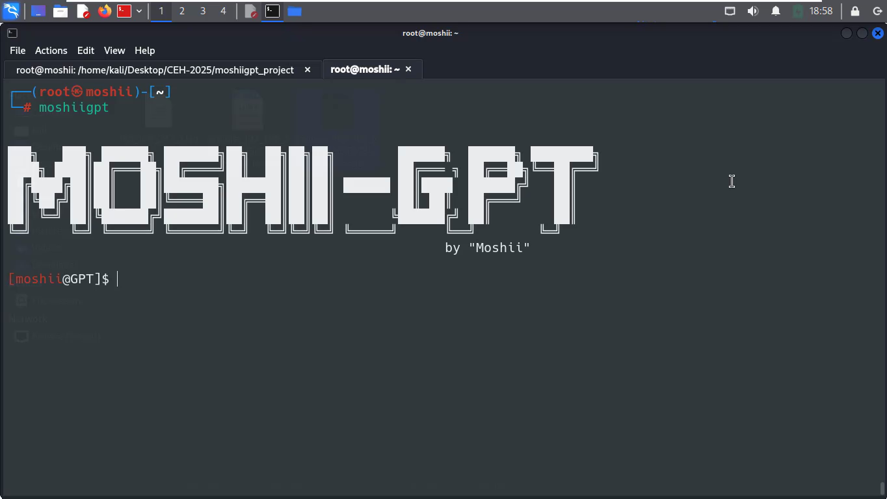

<h1 align="center">
  بــــسم الـلـه الرحــمــن الرحــيـم
</h1>
<h1 align="center">
  🚀 MoshiiGPT — CyberShell Assistant [EGYPT] 
</h1>

<p align="center">
  
</p>

<p align="center">
  <b>MoshiiGPT</b> is a sleek AI-powered cybersecurity shell assistant — 
  combining <code>OpenAI</code>, <code>DeepSeek</code>, and <code>Together AI</code> 
  into a beautiful terminal UI for OSINT, packet recording, scanning, and more!
</p>

---
## 🎯 Contribution & Roadmap

Multi-provider AI chat
Packet capture and real-time listening
OSINT collection with subdomain extraction
---
## ✨ Features

- 🔥 AI Chat Mode (ChatGPT, DeepSeek, Together.AI)
- 🕵️‍♂️ OSINT Gathering (WHOIS, DNS, Subdomains)
- 🎧 Packet Recording with `tcpdump`
- 👂 Listening on custom interfaces using `netcat`
- 📁 Logs saved in organized folders per target
- 🛡️ Works offline for passive recon
- 🤖 Smart shell interface: `[moshii@GPT]$` with command recall

---

## ⚙️ Installation
- └─# git clone https://github.com/G3t-Moshii/moshii-GPT.git
- └─# cd moshii-GPT
- └─# pip install -r requirements.txt
- └─# chmod +x moshiigpt
- └─# ./moshiigpt
---
## 🔧 Prerequisites
- Python 3.9+
- `nmap`, `tcpdump`, `netcat`, `curl`, `nuclei`, etc.

---
## 🔐 Setting Your API Keys :
{
  "chatgpt": "sk-...",

  "deepseek": "sk-...",
  
  "together": "sk-...",
  
  "virustotal": "VT-..."
}

---
## You can obtain these keys from:
-  OpenAI: https://platform.openai.com/account/api-keys
- DeepSeek: https://platform.deepseek.com
- Together: https://www.together.ai/
- VirusTotal: https://www.virustotal.com/gui/join-us

---
🧪 Features & Usage
✨ AI Chat Terminal

- chat --chatgpt Describe the scanning phase in pentesting
- chat --deepseek What is AV evasion?
- chat --together Explain buffer overflow
---
## 🌐 OSINT & Network Tools
  osint domain.com
## Start and stop packet captures:
- osint domain.com
- start record 192.168.1.10 http
- stop record 192.168.1.10
- show recordings [Saved in /Logs Folder]
## Listen for connections:
listen eth0 9090
## Scan Hash Files Using VirusTotal :
vt hashfile
---
### 📺 Video on YouTube :

[](https://youtu.be/uCELJLwFfhk)

---

 <h2 dir="rtl" align="left">📬 Contact Me</h2> <p align="center"> <a href="https://s3.us-east-1.amazonaws.com/moshii.com/portfolio.html">  </a> </p> ``` 
